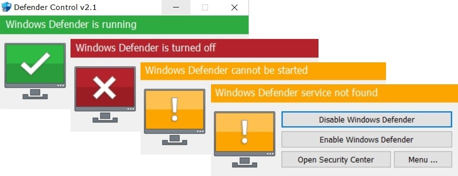

# DESCRIPTION
This config for TURN OFF/ON Windows Defender

How to use:
```
Run as Administrator. The SetACL.exe file must be in the same folder as the bat-file.
```
to turn OFF:
```
RUN  Defender_OFF.bat
(When using windows 11, restart and apply again.)
```
to DELETE:
```
RUN  Defender_DEL.bat
```
You can check the Windows Defender status by running the utility  dControl.exe



